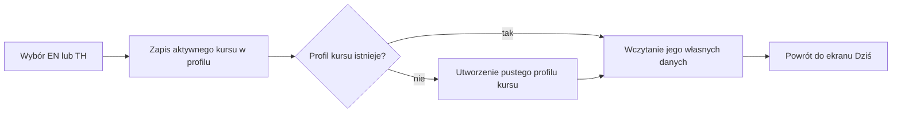

# Redesign UI/UX — Etap 1: fundament nawigacji i systemu interfejsu

**Status:** zakres implementacyjny ukończony; walidacja na fizycznych urządzeniach i z użytkownikami pozostaje częścią bramy badawczej.

## Cel

Etap 1 porządkuje główną architekturę aplikacji przed przebudową pojedynczych lekcji. Użytkownik ma zawsze rozumieć, gdzie się znajduje, którego kursu używa i gdzie zarządza kontem. Zmiany nie modyfikują wyników nauki ani harmonogramu SRS.

## Dostarczone rezultaty

| Rezultat                                             | Status                       | Dowód                                                          |
| ---------------------------------------------------- | ---------------------------- | -------------------------------------------------------------- |
| Stała nawigacja pięciu głównych obszarów             | gotowe                       | `apps/mobile/src/home/nav-bar.tsx`                             |
| Nazwa „Praktyka” dla obszaru ćwiczeń konwersacyjnych | gotowe w PL/EN/TH            | `packages/i18n/src/index.ts`                                   |
| Widoczny przełącznik aktywnego kursu                 | gotowe                       | `apps/mobile/src/ui/course-switcher.tsx`                       |
| Trwały zapis aktywnego kursu                         | gotowe                       | `PATCH /v1/auth/me/active-course`                              |
| Oddzielenie postępu EN i TH                          | gotowe i objęte testem       | `AuthService.switchActiveCourse`                               |
| Konto i wylogowanie wyłącznie w Profilu              | gotowe                       | `apps/mobile/src/home/profile-tab.tsx`                         |
| Semantyczne palety jasna, ciemna i kontrastowa       | gotowe jako kontrakt tokenów | `packages/ui/src/index.ts`                                     |
| Docelowa mapa tras i reguły widoków skupionych       | zatwierdzony kontrakt        | [`information-architecture.md`](./information-architecture.md) |

## Najważniejsze decyzje

1. Dolna nawigacja ma zawsze pięć pozycji: Dziś, Nauka, Praktyka, Postępy i Profil. Funkcja niedostępna przez flagę pozostaje na swoim miejscu jako nieaktywna, dzięki czemu układ nie zmienia się między sesjami.
2. Przełącznik kursu używa nazwy tekstowej (`EN · Angielski`, `TH · Tajski`), a nie samej flagi. Jest kontrolką typu radio i zachowuje cel dotykowy co najmniej 44 pt.
3. Zmiana kursu przełącza kontekst całej aplikacji i wraca do ekranu Dziś. Nie kopiuje poziomu, celu, postępu, SRS ani ustawień kursowych.
4. Jeżeli użytkownik wybierze kurs po raz pierwszy, API tworzy dla niego osobny profil z bezpiecznymi wartościami początkowymi.
5. Dane konta i wylogowanie nie są globalnym stopką. Znajdują się wyłącznie w Profilu.
6. Paleta `colors` pozostaje zgodna wstecznie z motywem jasnym. Nowe palety mają identyczny zestaw semantycznych kluczy, co umożliwia stopniową migrację ekranów bez jednorazowego ryzyka.

## Zachowanie przełączania kursu

## Skalowalność i kompromisy

- Przełączanie kursu jest osobnym punktem API, zamiast rozszerzenia ogólnej edycji profilu. Dzięki temu reguła rozdzielenia danych kursowych pozostaje po stronie serwera.
- Pełne przełączenie istniejących ekranów na motyw runtime nie zostało wykonane w tym etapie. Najpierw powstał zgodny kontrakt tokenów; migracja ekran po ekranie ogranicza ryzyko mieszanego kontrastu i regresji.
- Obecny shell zachowuje stan kart lokalnie. Docelowe ścieżki Expo Router są zamrożone w mapie IA, ale fizyczne rozdzielenie plików tras powinno następować razem z przebudową widoków skupionych, aby nie utrzymywać dwóch źródeł prawdy.
- Ikony dolnej nawigacji pozostają tymczasowe. Ich wymiana na jedną bibliotekę wektorową należy do etapu wizualnego i nie zmieni nazw ani kolejności kart.

## Brama jakości

Etap można uznać za gotowy technicznie po spełnieniu wszystkich warunków:

- typy przechodzą dla aplikacji mobilnej, API, tłumaczeń, kontraktów i tokenów;
- test serwera potwierdza, że przełączenie kursu nie kopiuje postępu;
- test tokenów potwierdza zgodny zestaw kluczy we wszystkich motywach;
- lint i formatowanie nie zgłaszają błędów w zmienionych plikach;
- na urządzeniu przełączenie EN → TH → EN zachowuje odrębne dane obu kursów;
- VoiceOver i TalkBack ogłaszają przełącznik jako grupę wyboru, a aktywny kurs jako zaznaczony;
- przy skali tekstu 200% etykiety nawigacji i przełącznika pozostają dostępne.

Ostatnie trzy punkty wymagają urządzenia lub sesji badawczej i nie powinny być zastępowane testem jednostkowym.
