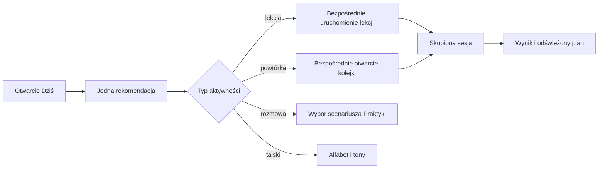

# Redesign UI/UX — Etap 2: główna pętla codziennej nauki

**Status:** implementacja techniczna ukończona; testy manualne na urządzeniach i walidacja z użytkownikami pozostają otwarte.

## Cel

Etap 2 skraca drogę od otwarcia aplikacji do wartościowej aktywności. Ekran Dziś nie jest już listą skrótów prowadzących do kolejnego katalogu — pokazuje jedną rekomendację i uruchamia wskazaną lekcję lub powtórkę bez ponownego wyszukiwania.

## Dostarczone rezultaty

| Rezultat                                                      | Status            | Dowód                                  |
| ------------------------------------------------------------- | ----------------- | -------------------------------------- |
| Jedna dominująca rekomendacja na ekranie Dziś                 | gotowe            | `apps/mobile/src/home/today-tab.tsx`   |
| Bezpośrednie uruchomienie konkretnej lekcji                   | gotowe            | `LearningIntent.kind = lesson`         |
| Bezpośrednie uruchomienie należnych powtórek                  | gotowe            | `LearningIntent.kind = reviews`        |
| Skupiony tryb nauki bez dolnej nawigacji i przełącznika kursu | gotowe            | `ProductHome.learningFocused`          |
| Powrót do początku ekranu po zmianie widoku                   | gotowe            | kontrola wspólnego `ScrollView`        |
| Ostrzeżenie przed utratą niewysłanej odpowiedzi               | gotowe w PL/EN/TH | `LessonView.requestClose`              |
| Wspólny wzorzec loading/error/empty/success                   | gotowe            | `apps/mobile/src/ui/state-panel.tsx`   |
| Postęp dzienny liczony według lokalnego dnia użytkownika      | gotowe            | `localDayBounds` i `completedMinutes`  |
| Odświeżenie planu po lekcji lub powtórce                      | gotowe            | unieważnianie zapytania `growth/today` |

## Nowy przepływ

## Hierarchia ekranu Dziś

1. Nagłówek i aktywny kurs.
2. Krótkie podsumowanie dziennego celu oraz wykonanych minut.
3. Jedna karta „Polecane teraz” z pełnowymiarowym CTA.
4. Drugorzędna lista „Następnie”.
5. Po wykonaniu celu — jednoznaczny stan sukcesu i opcjonalna dodatkowa nauka.

Pierwsza karta nie używa samego koloru do komunikowania priorytetu. Ma etykietę tekstową, tytuł, opis, czas i jedno CTA.

## Zasady postępu dziennego

- Dzień jest wyznaczany w strefie czasowej zapisanej dla konkretnego kursu, z uwzględnieniem zmiany czasu.
- Ukończona lekcja daje domyślnie 5 minut, rozmowa 5 minut, a pojedyncza powtórka 2 minuty, jeśli zdarzenie domenowe nie zawiera dokładnego czasu.
- Dokładna wartość `minutes` ze zdarzenia ma pierwszeństwo przed estymacją.
- Po osiągnięciu dziennego celu serwer nie dokłada automatycznie kolejnej rekomendacji. Użytkownik może świadomie przejść do dodatkowej nauki.
- Treść odpowiedzi i lekcji nie trafia do telemetrii produktu.

## Obsługa stanów i błędów

| Stan                              | Zachowanie                                                            |
| --------------------------------- | --------------------------------------------------------------------- |
| ładowanie                         | stabilny panel z opisem tego, co jest przygotowywane                  |
| błąd planu                        | wyjaśnienie, zapewnienie o bezpieczeństwie postępu i akcja ponowienia |
| uruchamianie aktywności           | skupiony panel ładowania bez możliwości przypadkowej zmiany karty     |
| brak aktywności po wykonaniu celu | stan sukcesu zamiast pustej listy                                     |
| niewysłana odpowiedź              | potwierdzenie przed wyjściem                                          |
| błąd uruchomienia lekcji          | powrót do katalogu z komunikatem, bez zablokowania interfejsu         |

## Kompromisy i dalsze rozszerzenia

- Skupienie jest obecnie kontrolowane przez shell aplikacji, dzięki czemu istniejąca logika sesji pozostaje jednym źródłem prawdy. Fizyczne wydzielenie tras Expo Router można wykonać po przeniesieniu sesji użytkownika do wspólnego kontekstu routingu.
- Minuty są estymowane dla starszych zdarzeń domenowych, które nie przechowują czasu aktywności. Kontrakt obsługuje dokładne minuty, więc źródła mogą być migrowane stopniowo.
- Rozmowa nadal prowadzi najpierw do wyboru scenariusza — jest to decyzja świadoma, ponieważ użytkownik powinien znać rolę i tryb korekty przed wysłaniem wiadomości.
- Test poziomujący pozostaje dostępny w Nauka i korzysta z tego samego trybu skupionego po rozpoczęciu.

## Brama jakości

- typy przechodzą dla aplikacji mobilnej, API, kontraktów i tłumaczeń;
- testy silnika potwierdzają limit dzienny oraz granice lokalnego dnia;
- test serwisu potwierdza wykorzystanie zdarzeń kursu w planie;
- lint, formatowanie i kontrola różnic nie zgłaszają problemów;
- na urządzeniu rekomendacja lekcji otwiera właściwą lekcję jednym działaniem;
- VoiceOver i TalkBack ogłaszają postęp, główne CTA i ostrzeżenie wyjścia;
- przy tekście 200% główna akcja i zamknięcie sesji pozostają osiągalne;
- tryb offline zostaje sprawdzony z kolejką odpowiedzi i późniejszą synchronizacją.

Ostatnie cztery punkty wymagają urządzeń lub sesji badawczej i nie są zastępowane testem jednostkowym.
