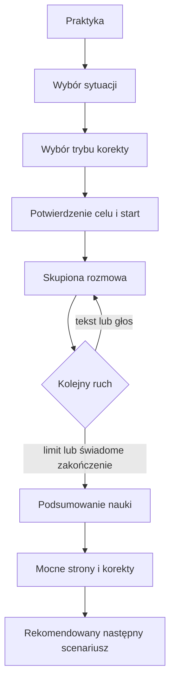

# Redesign UI/UX — Etap 4: Praktyka i rozmowy z tutorem AI

**Status:** implementacja techniczna ukończona; testy rozmów z prawdziwym dostawcą AI, VoiceOver/TalkBack i badania użyteczności na urządzeniach pozostają otwarte.

## Cel

Etap 4 zmienia rozmowę AI z długiego formularza w prowadzoną sesję treningową. Przed startem użytkownik zna sytuację, cel, rolę rozmówcy, poziom, czas i sposób otrzymywania korekt. Podczas rozmowy interfejs skupia uwagę na dialogu, a po zakończeniu zamienia wynik w konkretne wskazówki do dalszej nauki.

## Dostarczone rezultaty

| Rezultat                                                         | Status            | Dowód                                    |
| ---------------------------------------------------------------- | ----------------- | ---------------------------------------- |
| Kontekst i ograniczenia AI przed rozpoczęciem                    | gotowe            | hero Praktyki i jawny komunikat zaufania |
| Scenariusze z kategorią, poziomem, czasem, celem i rolą          | gotowe            | `ChatTab` i `scenarioCard`               |
| Cztery tryby korekty z opisem konsekwencji                       | gotowe w PL/EN/TH | tłumaczenia i `correctionMode`           |
| Jednoznaczne podsumowanie konfiguracji i CTA                     | gotowe            | `startSummary`                           |
| Skupiony shell bez globalnej nawigacji i zmiany kursu            | gotowe            | `ProductHome.practiceFocused`            |
| Jawne role „Ty” i „Tutor AI” przy wiadomościach                  | gotowe            | grupy wiadomości i etykiety ról          |
| Oddzielenie korekty od treści wypowiedzi                         | gotowe            | `inlineCorrection` poza dymkiem          |
| Dostępny status odpowiedzi AI i nagrywania                       | gotowe            | live regiony i etykiety dostępności      |
| Bezpieczne wyjście z ostrzeżeniem                                | gotowe            | `requestExit`                            |
| Obsługa pustki, ładowania, błędów i limitu sesji                 | gotowe            | wspólny `StatePanel`                     |
| Pełne podsumowanie: mocne strony, korekty, słowa i następny krok | gotowe            | widok `ConversationSummary`              |
| Reguły dostępności podsumowania i limitów objęte testami         | gotowe            | `conversation-presentation.test.ts`      |

## Przepływ docelowy

## Zasady konfiguracji

- Karta scenariusza pozwala podjąć decyzję bez otwierania kolejnego ekranu: pokazuje typ sytuacji, trudność, szacowany czas, zadanie oraz rolę AI.
- Tryb „tylko ważne błędy” pozostaje rozsądnym ustawieniem domyślnym: chroni płynność, ale nie pozostawia błędów zmieniających sens bez reakcji.
- Każdy tryb korekty wyjaśnia nie tylko nazwę, lecz także wpływ na rytm rozmowy.
- Bezpośrednio nad CTA pojawia się krótkie potwierdzenie wybranego scenariusza i trybu.
- Interfejs informuje przed startem, że odpowiedzi AI mogą wymagać oceny użytkownika.

## Zasady skupionej rozmowy

1. Po starcie znikają dolna nawigacja i przełącznik kursu, aby przypadkowe dotknięcie nie przerwało zadania.
2. Górny pasek stale pokazuje bezpieczne wyjście oraz pozostały budżet wiadomości.
3. Cel scenariusza pozostaje widoczny nad dialogiem.
4. Każda wypowiedź ma tekstową etykietę roli; kierunek i kolor dymka są tylko dodatkowymi sygnałami.
5. Korekta jest osobną kartą pod wypowiedzią, a nie częścią odpowiedzi rozmówcy.
6. Stan generowania odpowiedzi i nagrywania jest ogłaszany technologiom asystującym.
7. Zakończenie pozostaje nieaktywne do czasu wysłania pierwszej wiadomości, zgodnie z regułą API.
8. Po wykorzystaniu limitu kompozytor znika i ustępuje jednoznacznemu CTA do podsumowania.

## Głos, zaufanie i prywatność

- Przed użyciem głosu aplikacja jasno informuje, że wiadomość trafia do transkrypcji, ale samo nagranie nie jest przechowywane.
- Odmowa uprawnienia mikrofonu daje komunikat tekstowy i nie blokuje wysyłania tekstu.
- Nagranie można wysłać albo usunąć przed transmisją.
- Odpowiedź AI można zgłosić; po sukcesie etykieta zmienia się na „Zgłoszono”, co zapobiega wielokrotnemu wysłaniu.
- Treść rozmowy nie jest dodawana do telemetrii produktu. Zdarzenie startu zawiera wyłącznie język, identyfikator scenariusza i tryb korekty; ukończenie jest rejestrowane autorytatywnie przez API.

## Podsumowanie nauki

Po zakończeniu użytkownik widzi w kolejności:

1. wynik jakościowy i główną rekomendację;
2. mocne strony, aby utrzymać motywację;
3. poprawki z oryginałem, lepszą wersją i wyjaśnieniem;
4. nowe słowa, jeśli dostarczył je silnik podsumowania;
5. następny krok oraz jedno CTA do kolejnego scenariusza.

Sekcje bez danych są ukrywane, z wyjątkiem korekt — ich brak jest jawnie komunikowany jako pozytywny wynik, nie jako awaria lub pusta karta.

## Skalowalność i kompromisy

- `conversationProgress` oddziela reguły blokowania zakończenia i obsługi limitu od komponentu widoku oraz ma testy jednostkowe.
- Widoki stanów korzystają z istniejącego `StatePanel`, a kolory z semantycznych tokenów; nowa lokalna paleta nie została wprowadzona.
- Etap wykorzystuje istniejący endpoint rozmowy i kontrakt podsumowania. Nie wymaga migracji bazy ani nowego stanu serwerowego.
- Skupienie jest sterowane przez shell ekranu. Pełne wydzielenie rozmowy do osobnej trasy będzie zasadne po przeniesieniu sesji użytkownika do wspólnego routingu.
- Rezygnacja z aktywnej rozmowy nie oznacza jej ukończenia. Wiadomości pozostają objęte istniejącą retencją, ale zdarzenie ukończenia powstaje dopiero po wygenerowaniu podsumowania.
- Animacja odpowiedzi pozostaje lekka i tekstowa. Bardziej rozbudowana postać lub animacje Lottie zwiększyłyby koszt, wagę aplikacji i ryzyko rozpraszania, więc powinny być poprzedzone eksperymentem.

## Brama jakości i walidacja

Automatycznie:

- typecheck aplikacji mobilnej i tłumaczeń;
- lint zmienionych plików;
- testy `conversationProgress` dla braku wypowiedzi, limitu i blokady serwera;
- kontrola formatowania oraz `git diff --check`;
- pełna regresja monorepo przed zamknięciem etapu.

Manualnie na urządzeniu:

- start każdego scenariusza i każdego trybu korekty w PL, EN i TH;
- tekst, nagranie, odmowa mikrofonu, usunięcie i wysłanie nagrania;
- przerwanie rozmowy przed i po pierwszej wiadomości;
- osiągnięcie limitu oraz wygenerowanie podsumowania;
- zgłoszenie odpowiedzi AI i próba ponownego zgłoszenia;
- tekst 200%, mały ekran, tryb ciemny i wysoki kontrast;
- VoiceOver/TalkBack: kolejność fokusu, role wiadomości, status odpowiedzi i nagrywania.

## Wskaźniki po wdrożeniu

- `conversation_started / wejścia do Praktyki` — czy wybór scenariusza pomaga rozpocząć;
- `conversation_completed / conversation_started` — czy sesje prowadzą do podsumowania;
- mediana liczby tur oraz czas do pierwszej wiadomości;
- udział głosu w wysłanych turach i odsetek odmów mikrofonu;
- udział zgłoszonych odpowiedzi;
- retencja D1/D7 użytkowników, którzy ukończyli rozmowę, względem osób bez rozmowy.

Progi decyzyjne należy ustalić po zebraniu baseline'u z Etapu 0. Żaden KPI nie powinien premiować sztucznego wydłużania rozmowy kosztem jakości nauki.
